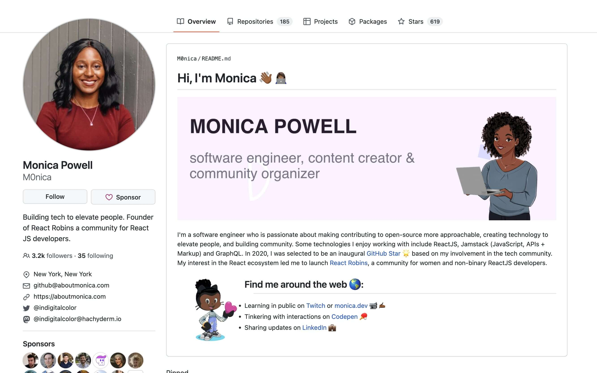

Hey there, fellow developers! As a front-end developer myself, I know how challenging it can be to navigate the job market and stand out among the sea of talented candidates. One of the most critical aspects of your online presence is your GitHub profile. It's like your digital portfolio, showcasing your skills, projects, and expertise to potential employers. In this guide, I'll share my top tips for acing your GitHub game and creating a profile that impresses recruiters and hiring managers alike. So, let's dive in!

### Optimize Your Profile Information and Create a Custom About Section
Your GitHub profile is your opportunity to make a strong first impression. Be sure to include a professional, clear profile picture (preferably a headshot) and a concise, informative bio. Mention your areas of expertise, programming languages, and tools you're comfortable with, and any relevant personal or professional achievements.

In addition to optimizing your profile information, you can create a custom About section by leveraging the [GitHub special repository feature](https://docs.github.com/en/account-and-profile/setting-up-and-managing-your-github-profile/customizing-your-profile/managing-your-profile-readme). This is a unique repository that matches your GitHub username and is automatically displayed as a README on your profile page. It allows you to provide an extended bio, showcase your projects, display your tech stack, and include any other relevant information you want to share with visitors.

To create your special repository, simply create a new repository with the same name as your GitHub username (for example, if your username is 'johndoe', create a repository named 'johndoe'). Add a README.md file to the repository, and use markdown to format and style the content as desired. Get the best inspirations from this awesome [library of GitHub profiles](https://zzetao.github.io/awesome-github-profile/).

For example, check [Monica Powell's GitHub profile](https://github.com/M0nica). Her special repository adds a personal touch to her GitHub profile, with an introduction, a list of her skills, and links to her blog and other social media platforms. She also includes a dynamic GitHub stats widget to showcase her GitHub activity visually.

By optimizing your profile information and creating a custom About section using the GitHub special repository, you can give potential employers and collaborators a more comprehensive overview of who you are, what you do, and what you're passionate about. This can further enhance your GitHub profile and increase your chances of standing out in the job market.

### Showcase your best work
When selecting repositories to feature on your profile, choose the ones that best represent your skills and experience. Prioritize projects that demonstrate your expertise in your desired field or role. Don't forget to add clear, informative README files to each repository, explaining the project's purpose, functionality, and technologies used. This way, potential employers can quickly understand what each project is about and how it showcases your abilities.

### Contribute to open-source projects
Contributing to open-source projects is a fantastic way to showcase your coding skills, teamwork, and passion for software development. Active participation in the open-source community can also help you build a network of like-minded developers and gain valuable experience that can boost your resume.

### Keep your profile active
Regularly update your GitHub profile with new projects, contributions, and improvements to existing repositories. This demonstrates your commitment to continuous learning and growth, which is highly valued by employers. Plus, it's an excellent way to keep your skills sharp and stay current with industry trends and best practices.

### Highlight your soft skills
While technical expertise is crucial, employers also value soft skills like communication, collaboration, and problem-solving. Use your GitHub profile to showcase your ability to work in teams, contribute to discussions, and provide constructive feedback on others' work. This can be done through thoughtful issue reporting, engaging in meaningful conversations, and providing clear, concise documentation.

### Connect your GitHub profile to your professional network
Finally, don't forget to link your GitHub profile to your LinkedIn, personal website, or online portfolio. This helps create a cohesive online presence and makes it easy for potential employers to find and evaluate your work.

### Examples
Now let's see some good examples of well-crafted GitHub profiles that developers can take inspiration from. These profiles excel in various aspects, from optimized profile information to an active presence in the open-source community:

- [Tania Rascia](https://github.com/taniarascia): Tania's profile features a clear profile picture, a concise bio that highlights her expertise, and links to her personal website. She has also pinned her most significant projects, which showcase her skills as a developer.

- [Kent C. Dodds](https://github.com/kentcdodds): Kent's GitHub profile demonstrates his expertise in JavaScript, React, and testing through numerous pinned repositories, each with a descriptive README file.

- [Addy Osmani](https://github.com/addyosmani): Addy is an active contributor to various open-source projects, including Google Chrome and popular JavaScript libraries. His contributions demonstrate his expertise in web performance and JavaScript.

- [Sindre Sorhus](https://github.com/sindresorhus): Sindre has an impressive number of repositories and frequently updates his projects, showcasing his ongoing commitment to learning and improvement.

- [Wes Bos](https://github.com/wesbos): - Wes's GitHub profile showcases his ability to communicate effectively and collaborate with others through numerous repositories and active participation in project discussions.

These examples illustrate how a well-rounded GitHub profile can showcase your technical skills, open-source contributions, and soft skills, making a lasting impression on potential employers.

### Conclusion:
A well-crafted GitHub profile can be the key to landing that dream developer job. By optimizing your profile information, showcasing your best work, contributing to open-source projects, staying active, highlighting your soft skills, and connecting your GitHub profile to your professional network, you'll be well on your way to acing your GitHub game and making a lasting impression on potential employers.