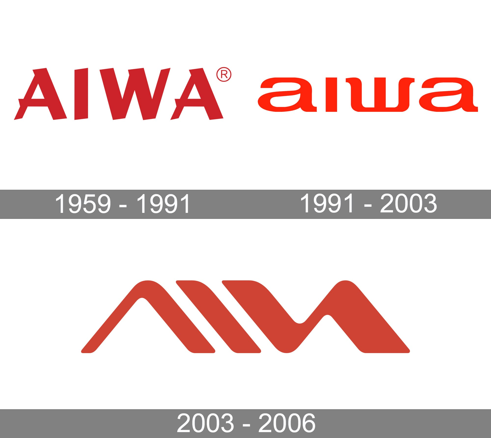
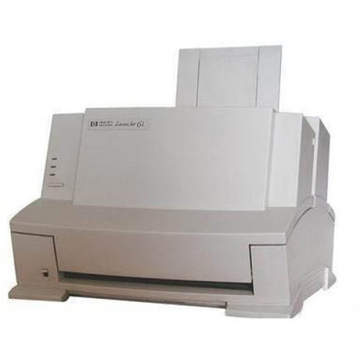

22 years ago, my father and I embarked on our very first business venture. The other day, we were talking about the past, and our conversation led to the small businesses we started years ago.

Our story goes back to the late '90s when the Aiwa brand was a giant in the electronic industry. My father, an authorized service representative for the brand, was constantly engaged with their products. At that time, MP3 technology was just being introduced to devices, and although Sony refused to adopt it for years, MP3 was slowly becoming the dominant format in the market.

### Where did the idea come from?

The problem was that the introduction of new technology required more education. Customers would come to my father's shop with questions because there were no Persian instruction manuals, turning the situation into a nightmare for them. At that time, playback devices supported cassette tapes, CDs, and radios, so adding MP3 support, which required searching through folders and hundreds of songs, made things even more complicated.

My father decided to translate the instruction manuals for these devices. He began by asking customers who visited the shop to provide their manuals along with their devices, eventually gathering a complete collection of manuals. After closing the shop for the day, my father would translate the manuals, while I typed the contents on an AMD 800 system using Microsoft Word.

Our main challenge was the images in the original manuals. We purchased a Genius scanner to scan the images, and then we used Paint to remove the English text and numbers from the pages. We then copied the translated and typed text using screenshots and placed them alongside the original images. Finally, we printed and stapled the translated manuals using an HP Laserjet 6L printer which my uncle brought from Japan and we bought it from him. The cover design was simple but fully functional.

One helpful strategy was standardizing our translations. Many parts of the manuals were identical, so we were able to increase our production speed for different models by copying the identical pages. If I recall correctly, the price of each translated manual was around 2$, and we had many customers. Our manuals were the same A5 horizontal size as the original ones, and due to their resemblance, they were well-received. Sometimes, we struggled to keep up with the demand.

Our first business experience was a great one for me. Although it wasn't a large-scale operation, we aimed to prioritize the user experience (something we understand better nowadays) and never settled for just producing a product. A good product requires effort and attention, but it is attainable.
